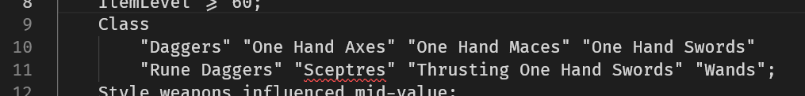
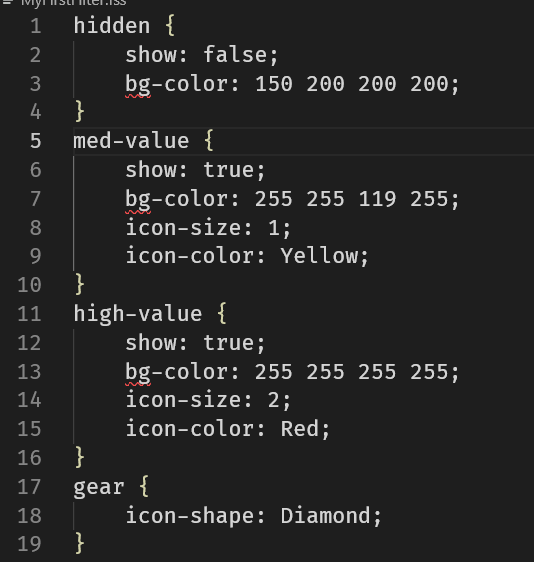
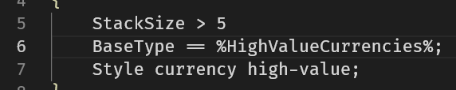
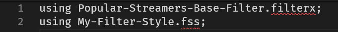
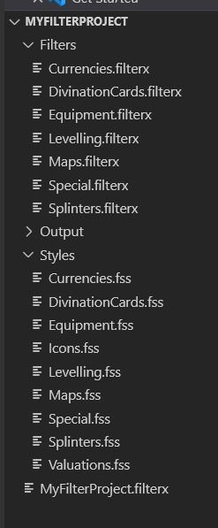
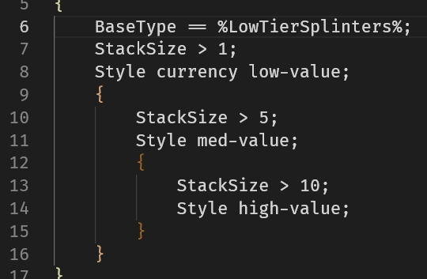

# PoeFilterX
Advanced Loot Filter Transpiler for Path of Exile that allows for numerous powerful features not normally available on vanilla filter files.

# Cut to the chase, where do I start?

Head over to the [Installation Guide](https://github.com/SteffenBlake/PoeFilterX/wiki/Installation) and then check out the [Your first Project](https://github.com/SteffenBlake/PoeFilterX/wiki/Your-First-Project) guide!

# Features

The list of features provided by PoeFilterX is quite extensive, check them out!

## Multiline Filter Commands!
With semicolon delimitting, enjoy substantially easier to read filters with multiline commands!

## Composable and Re-usable Style Sheets!
Filter Composition has been broken out to seperate Filter Style Sheets (.fss files) which make your filter styling composable and modular for ease of re-use!

## Variable Injection!
Inject variables into the build runtime from other sources to easily update your filter on the fly. Might be time to get familiar with the poe.ninja API, perhaps?

## Filter and Style Inherittance!
Plug in existing style sheets and filterx files from content creators, then extend them with your own additional logic/styling!

Organize your filter project in a cohesive and logical way, instead of having one giant monolithic file to handle!

## Nested Filter Blocks!
Lower duplicate code by nesting Filter blocks in order to re-use patterns!

# Planned Feature Roadmap
Here's a list of features I plan to implement in the future as well, all are a Work in Progress

* [ ] - Package Management, to simplify importing of existing filter packages via `poefilterx install <packagename>`
* [ ] - `new` command to speed up the bootstrapping process of making a new filter project via `poefilterx new <projectName>`
* [ ] - Docker build image to further simplify the "plug and play" capability for power users who want to avoid installing yet another program
* [ ] - Advanced "Range" int variable for Operator Filter Commands, combining the `>=` + `<=` operators into one, IE `Quality 10~20;`
* [ ] - Visual Studio Extension for code highlighting, code completion, and comment/uncomment hotkey

# Investigating Features Triage
This is a list of features I am investigating, but currently have not conclude effort / viability.

* [ ] - Setup live monitoring of PathOfExile log file, letting users trigger commands via in game calls
* [ ] - Advanced Style Variables, letting you manipulate styles based on Filter Selectors via math. (IE: `font-size: (%MapTier% * 6);`)
* [ ] - Variable injection into Style Sheets as well. Currently doesn't seem necessary but perhaps might be worth adding to simplify workflows.

